# GardenSync

**A square-foot garden planner for a community garden in Canton, Ohio (USDA Zone 6a).**

Lay out raised beds and containers on a real spacing grid, check companion planting
before you commit, follow a frost-aware schedule through the season, log what you
actually pick, and hand the crew a printable plan. No accounts, no server, no build
step — everything lives in your browser and travels as a JSON file or a link.

**[Open the planner →](https://gardensync-e4e.pages.dev/)** ·
[Project page](https://samizdat-publications.github.io/gardensync/) ·
[Changelog](CHANGELOG.md)

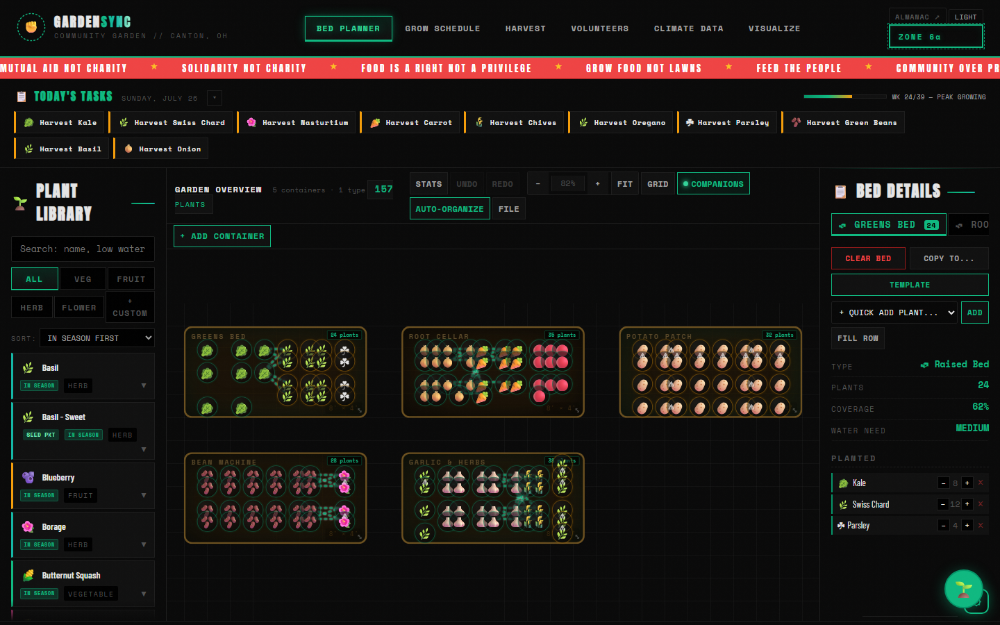

---

## What it is, and who it's for

A community garden that feeds neighbours has a specific problem: the people doing
the planting change week to week, the knowledge lives in one or two heads, and a
bed planted wrong in April is a bed that produces nothing in August. GardenSync is
an attempt to put that knowledge on the screen where a new volunteer can see it —
spacing, timing, what likes growing next to what — and to keep a record of what the
garden actually gave.

It is built around Canton's numbers: last frost **April 18**, first frost
**October 28**, a **193-day** season. Everything the schedule tells you is measured
from those dates. The plant data is general enough to be useful elsewhere, but the
calendar is honest about being local.

Nothing leaves your machine unless you ask it to. The garden autosaves to
`localStorage`; export is a JSON file or a link.

---

## The six workspaces

Across the top: **Bed Planner**, **Grow Schedule**, **Harvest**, **Volunteers**,
**Climate Data**, **Visualize**. They all read from the same garden.

### Bed Planner

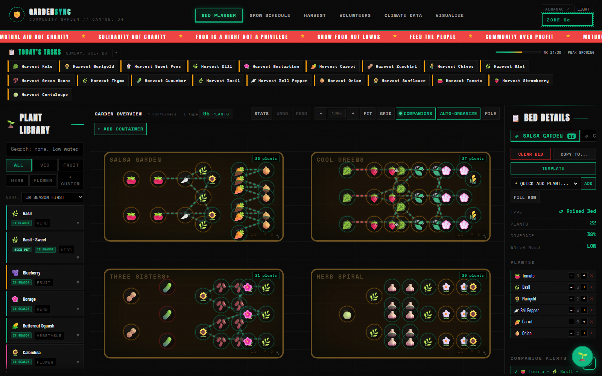

Click a seed in the library, click the bed, and the plant lands snapped to a 20px
grid with its real footprint reserved — sixteen carrots to a square foot, one tomato
to a 2×2. Pan, zoom, multi-select, drag, undo, redo. Beds, containers and plants are
ordinary DOM elements inside a panned and zoomed `#garden-canvas` div — every plant on
screen is a `div.placed-plant` you can inspect.

Seven container types are available: raised bed, planter box, round pot, grow bag,
in-ground plot, window box and potato tower. Seven pre-made bed templates (Salsa
Garden, Pizza Garden, Three Sisters, Salad Bowl, Pollinator Patch, Herb Haven, Kids
Garden) drop a whole planting in at once, and **auto-arrange** re-flows a bed to
Square Foot Gardening spacing.

### Grow Schedule

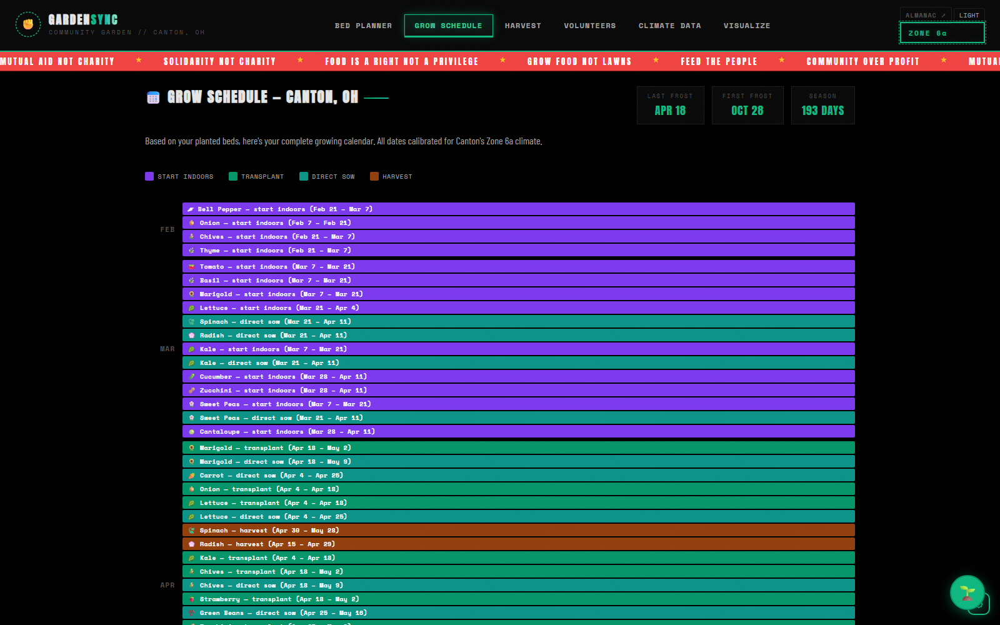

Every plant you place generates its own dates — start indoors, transplant, direct
sow, first harvest — worked backwards and forwards from the Canton frost windows.
Below the timeline is a task tracker you can tick off; the ticks are saved with the
garden.

### Harvest

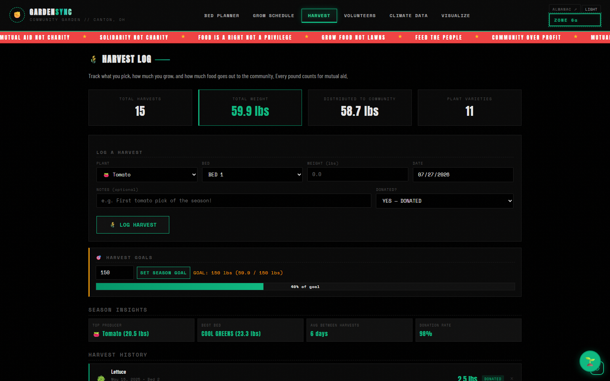

Log each pick with plant, bed, weight, date and a note. The season totals track
weight, varieties, and how much went out to the community — which is the number that
actually matters here.

### Volunteers

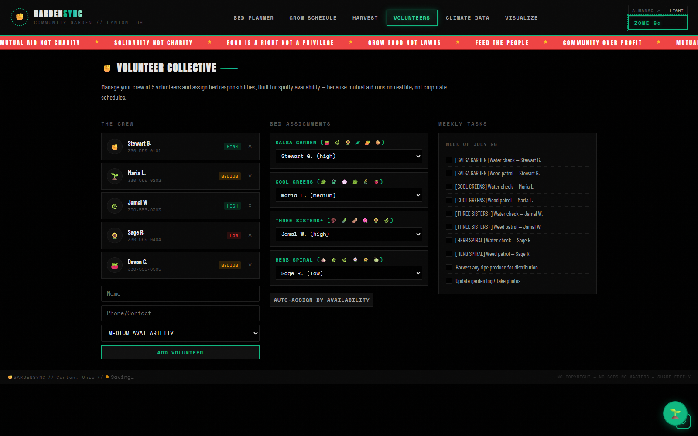

A crew list with availability levels, bed assignments, and this week's tasks.
There's an auto-assign that distributes beds by availability. It is deliberately
built for spotty attendance rather than a rota that assumes everyone shows up.

### Climate Data

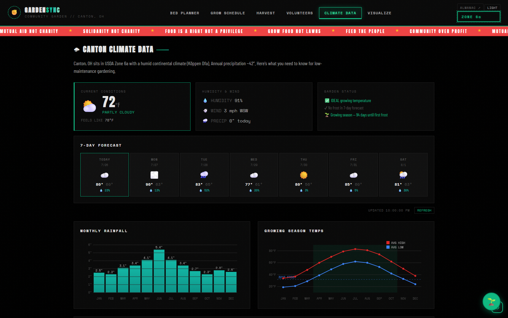

Live conditions and a 7-day frost watch from [Open-Meteo](https://open-meteo.com)
(no API key needed), plus monthly rainfall and growing-season temperature charts,
and a rainfall-versus-need comparison that uses your actual planted area and each
plant's water requirement.

### Visualize

Generates AI mockup images of a bed or the whole garden through Google Gemini, using
your own key. Optional, and the only workspace that does nothing useful without one.

---

## The plant library and companion planting

**77 plants** — 45 vegetables, 14 herbs, 15 flowers, 3 fruit. Every entry carries
spacing in inches, days to harvest, sun and water needs, seed-starting instructions,
care notes, sow and transplant timing relative to frost, and its companions and
antagonists.

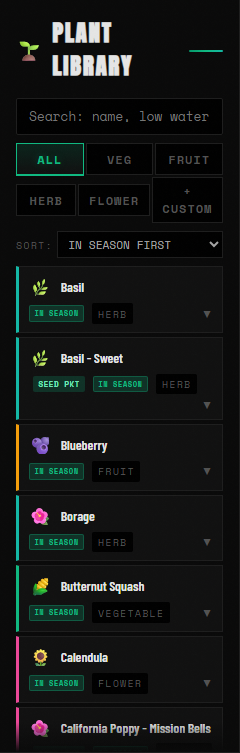

Companion relationships aren't buried in a tooltip — they're drawn. Compatible
neighbours are threaded together by lines in an SVG layer over the beds, and
conflicts are flagged as you place, not after.

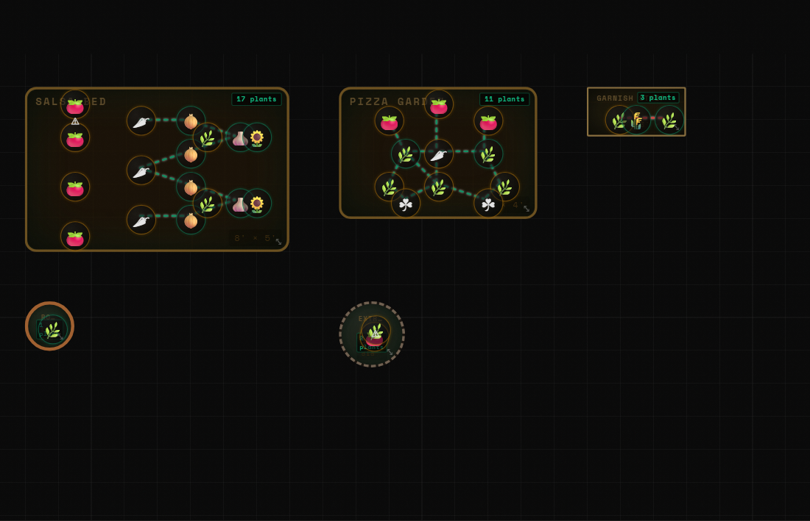

You can add your own seeds too, either by typing the details or by photographing a
seed packet and letting Claude read it — using the same key Garden Buddy uses.

---

## The three garden plans

Three researched five-bed plans for a Zone 6a community kitchen garden, each solving
a different constraint:

| Plan | Beds | Expected yield | Built for |
|------|-----:|----------------|-----------|
| **Full Research Plan** | 5 | 400–600 lbs | 175 plants across 26 distinct varieties, maximum nutritional diversity |
| **Easy Start** | 5 | 130–225 lbs | Year one — low-maintenance crops only |
| **Max Storage** | 5 | 250–400 lbs | Shelf-stable pantry crops, no refrigeration |

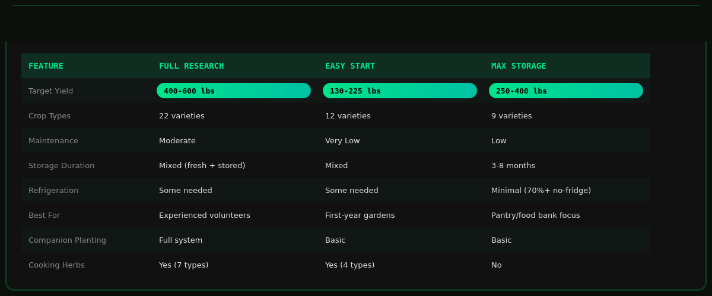

Each bed in each plan carries volunteer notes explaining *why* those crops, in that
arrangement, on that calendar — kale for cold-hardiness and cut-and-come-again yield,
parsley at the corners for beneficial insects, and so on. They're meant to be read as
much as loaded.

<details>
<summary>Bed-by-bed screenshots of each plan</summary>

**Full Research Plan** —
[Greens Powerhouse](docs/screenshots/full-plan-bed1-greens-powerhouse.png) ·
[Tomato & Pepper HQ](docs/screenshots/full-plan-bed2-tomato-pepper-hq.png) ·
[Underground Vault](docs/screenshots/full-plan-bed3-underground-vault.png) ·
[Calorie Central](docs/screenshots/full-plan-bed4-calorie-central.png) ·
[Storage & Protein](docs/screenshots/full-plan-bed5-storage-protein.png) ·
[overview](docs/screenshots/plan-full-research-plan-overview.png)

**Easy Start** —
[Greens Bed](docs/screenshots/easy-start-bed1-greens-bed.png) ·
[Root Cellar](docs/screenshots/easy-start-bed2-root-cellar.png) ·
[Potato Patch](docs/screenshots/easy-start-bed3-potato-patch.png) ·
[Bean Machine](docs/screenshots/easy-start-bed4-bean-machine.png) ·
[Garlic & Herbs](docs/screenshots/easy-start-bed5-garlic-herbs.png) ·
[overview](docs/screenshots/plan-easy-start-overview.png)

**Max Storage** —
[Potato Bed A](docs/screenshots/max-storage-bed1-potato-bed-a.png) ·
[Potato Bed B](docs/screenshots/max-storage-bed2-potato-bed-b.png) ·
[Allium Fortress](docs/screenshots/max-storage-bed3-allium-fortress.png) ·
[Squash & Beans](docs/screenshots/max-storage-bed4-squash-beans.png) ·
[Greens & Carrots](docs/screenshots/max-storage-bed5-greens-carrots.png) ·
[overview](docs/screenshots/plan-max-storage-overview.png)

</details>

---

## Demo gardens

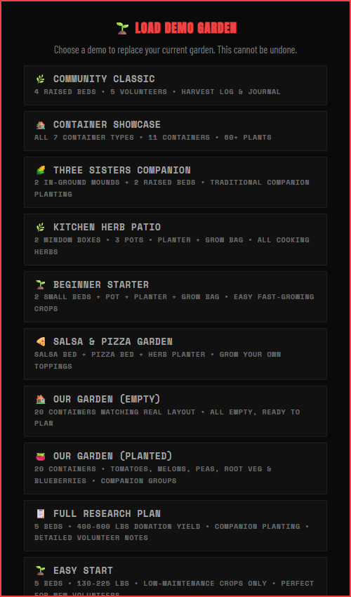

Eleven gardens ship with the app, loadable from `FILE ▸ LOAD DEMO GARDEN`:

| Garden | What it shows |
|--------|---------------|
| Community Classic | 4 raised beds, 5 volunteers, harvest log and journal |
| Container Showcase | All 7 container types across 11 containers |
| Three Sisters Companion | Corn, beans and squash in traditional groupings |
| Kitchen Herb Patio | Window boxes, pots, planter and grow bag |
| Beginner Starter | Small beds and containers, fast easy crops |
| Salsa & Pizza Garden | Two themed beds plus a herb planter |
| Our Garden (Empty / Planted) | A real 20-container layout, before and after |
| Full Research Plan | 5 beds, 400–600 lbs |
| Easy Start | 5 beds, 130–225 lbs |
| Max Storage | 5 beds, 250–400 lbs |

Easy Start loads on a first visit so nobody meets an empty screen.
`FILE ▸ NEW GARDEN` clears back to empty beds.

---

## Garden Buddy

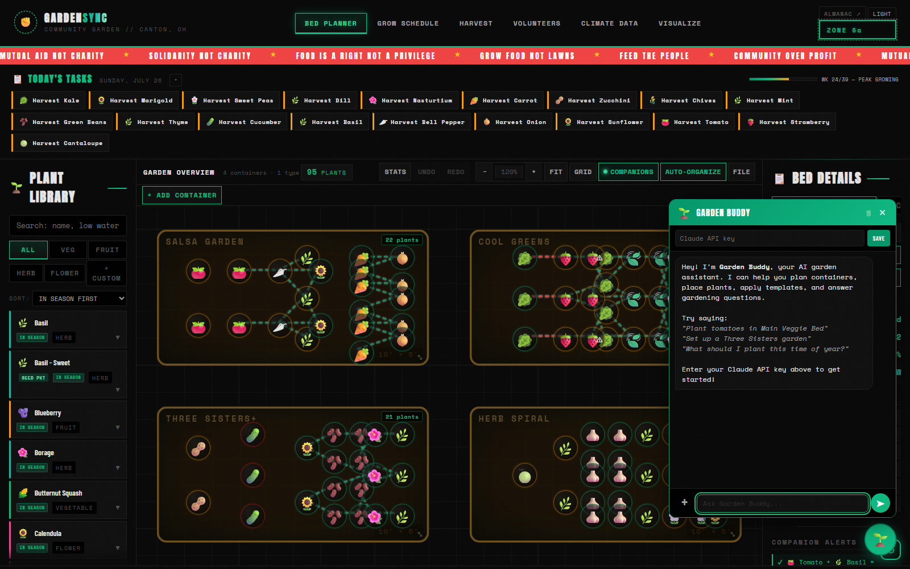

An assistant that can actually touch the garden. It runs on Claude Sonnet 5 with
tool use — `place_plant`, `remove_plants`, `clear_bed`, `apply_template`,
`organize_bed`, `rename_bed`, `get_garden_state`, `get_plant_info`, `list_plants`
and `get_schedule_advice`. Its system prompt carries the live garden state, the frost
dates and the location, so *"put four tomatoes in the sunny bed"* and *"when should I
start garlic here?"* both land.

It is called directly from the browser with a key you paste in yourself. The key
stays in your browser and goes straight to the API — it never passes through a server
of ours.

---

## Run it locally

```bash
python proxy.py
```

Serves the app on <http://localhost:8080> and proxies `/api/gemini/*`, which is what
the Visualize workspace calls. Garden Buddy and the seed-packet reader don't use the
proxy at all — they go straight from the browser to `api.anthropic.com` with the key
you paste in, in development exactly as in production. There is nothing to install and
nothing to build.

### Tests

Open them in a browser — there is no test runner:

- [`tests/test-pure-logic.html`](tests/test-pure-logic.html) — unit tests for the pure logic functions
- [`tests/test-integration.html`](tests/test-integration.html) — integration tests

### Optional configuration

| Feature | What it needs |
|---------|---------------|
| Cloud sync | Copy [`js/supabase-config.example.js`](js/supabase-config.example.js) to `js/supabase-config.js` and fill in your project. Without it the app logs one line and runs happily on `localStorage` alone. |
| Garden Buddy | Your own Anthropic API key, pasted into the chat panel. |
| Visualize | Your own Google Gemini API key, pasted into that workspace. |

---

## Deploying

```bash
./deploy.sh            # stage dist/ and publish to Cloudflare Pages
./deploy.sh --stage    # stage only, don't deploy
```

`deploy.sh` assembles `dist/` fresh on every run from `index.html`, `styles.css`,
`guide.html` and `js/` — deliberately leaving behind the pre-refactor monolith,
personal garden JSON, screenshots and notes that live in the repo root. It also
writes a `_headers` file and a stub `supabase-config.js` so the script tag resolves
on the public build.

Never edit `dist/` by hand, and never deploy the repo root.

---

## Project structure

```
gardensync/
├── index.html              # The whole app — every workspace, one document
├── styles.css              # All styling
├── guide.html              # User guide, opened from the FILE menu
├── js/                     # 33 modules, loaded in order by index.html
│   ├── state.js            # Global state object, undo/redo stacks
│   ├── constants.js        # 77 plants, Zone 6a data, container types, demo gardens
│   ├── canvas.js           # Bed rendering, pan/zoom, resizable panels
│   ├── placement.js        # Click-to-place, grid snapping, spacing checks
│   ├── containers.js       # Bed and container geometry
│   ├── selection.js        # Selection, multi-select, drag
│   ├── organize.js         # Square Foot Gardening auto-arrangement
│   ├── schedule.js         # Frost-relative planting calendar
│   ├── harvest.js          # Harvest log and season totals
│   ├── volunteers.js       # Crew, assignments, weekly tasks
│   ├── climate.js          # Canvas-drawn climate charts
│   ├── weather.js          # Open-Meteo live weather and frost watch
│   ├── persistence.js      # localStorage load/save, first-run seeding
│   ├── supabase-sync.js    # Optional cloud backup
│   ├── data-io.js          # Export/import, share links, demo registry
│   ├── custom-seeds.js     # User-added seeds, seed-packet photo reading
│   ├── garden-buddy.js     # Claude assistant with tool use
│   └── …                   # 16 more
├── docs/                   # Project page and screenshots
├── tests/                  # Browser-opened test pages
├── proxy.py                # Dev server + API proxy
└── deploy.sh               # Stage dist/ and publish
```

### Constraints, on purpose

- **No bundler, no framework, no npm dependencies at runtime.** Every module is a
  plain `<script src="js/…">` tag in `index.html`, loaded in dependency order.
  They communicate through a shared global `state` object and functions on `window`.
- **DOM for the garden, canvas only where it earns it.** Beds and containers are
  `div.garden-bed`, each plant a `div.placed-plant`, all inside the panned and zoomed
  `#garden-canvas` div; the companion threads are an SVG overlay built with
  `createElementNS`. Real `<canvas>` shows up in exactly three places — the climate
  charts, the PNG export, and preprocessing seed-packet photos. No D3, no Chart.js.
- **One mutation path.** Every change to the garden goes through `pushUndo()` first,
  which is what makes undo/redo reliable rather than approximate.
- **CSS custom properties for theming**, so the light theme is a variable swap
  rather than a second stylesheet.

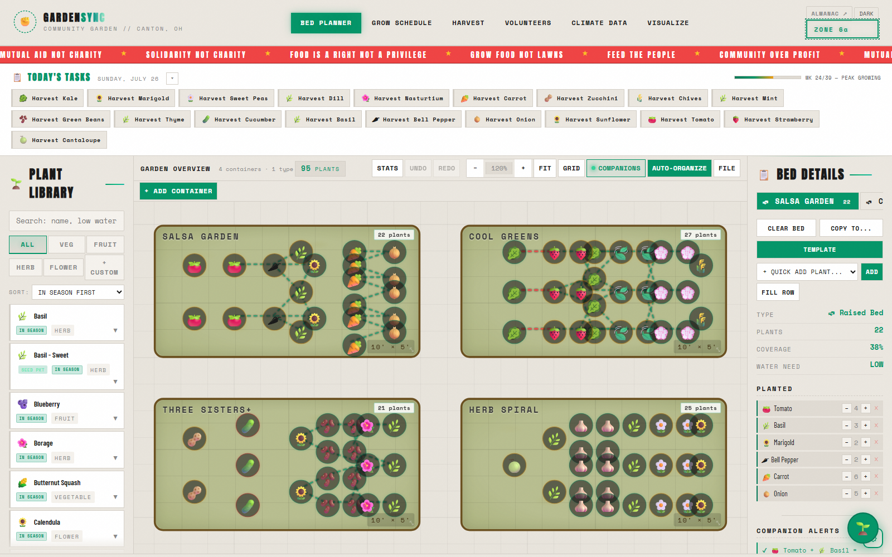

It works on a phone, where the side panels become drawers:

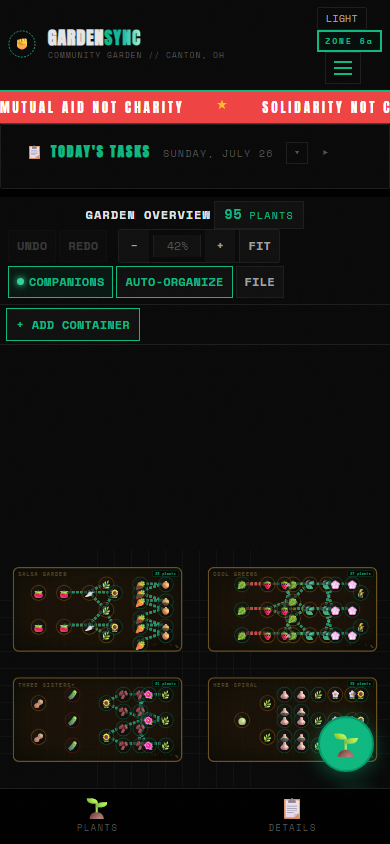

> **One layout gotcha worth knowing before you touch `canvas.js`:** the sidebar and
> palette resize handles write an inline `grid-template-columns` on
> `.planner-layout`, and inline styles outrank the `max-width: 900px` media query
> that collapses the planner to a single column on phones. All grid writes must go
> through `_setLayoutColumns()`, and `initLayoutBreakpointSync()` must run after both
> resize inits. Writing that property directly will squeeze the garden viewport on
> mobile.

---

## Its sibling

There's a second edition of this idea, rebuilt from nothing and sharing no code:
**[A Quiet Almanac](https://gardensync-almanac.pages.dev/)** — the same 77 plants and
the same Zone 6a frost dates, rendered as warm paper and botanical ink, with a season
ribbon you drag to watch the garden grow and fade across the year. Same agronomy,
opposite temperament. Source at
[Samizdat-Publications/gardensync-almanac](https://github.com/Samizdat-Publications/gardensync-almanac).

Two front doors. Take whichever one suits how you think.

---

## Contributing

Fork, branch, change, open a pull request. The things that would help most:

- More plants, especially regional and heirloom varieties
- Demo gardens calibrated for other zones and climates
- A better volunteer scheduling UI
- Translations

---

## Credits

Built by and for **Canton, Ohio** and the wider mutual-aid gardening
community. Companion planting data from published guides and several seasons of
kitchen-garden practice. Weather from [Open-Meteo](https://open-meteo.com). AI from
[Anthropic](https://www.anthropic.com). Fonts — Anton, Space Mono, Barlow Condensed —
from Google Fonts.

Intended for release under the **GNU Affero General Public License v3.0** — the
`LICENSE` file has not been added to the repo yet (TODO: add the AGPL-3.0 text at the
repo root). The ask doesn't change either way: if you improve it, share the
improvements back.

**Let's grow food for our communities.**
