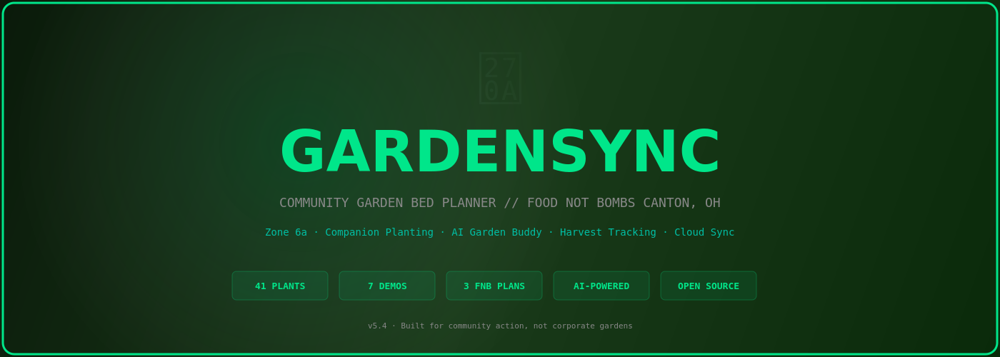
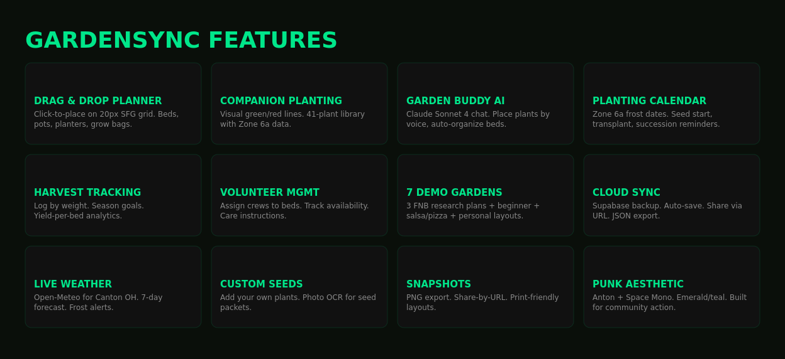
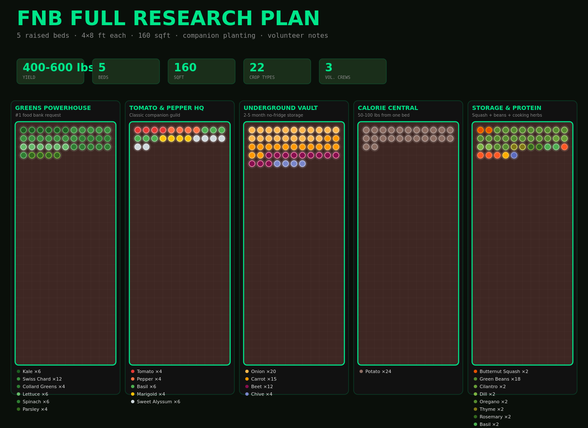
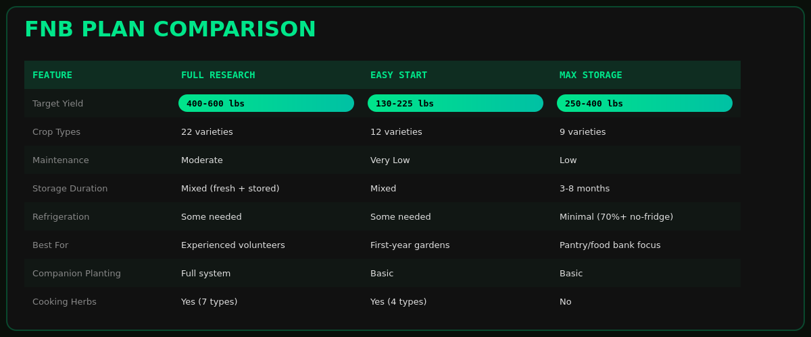

# GardenSync



**Community Garden Bed Planner for Food Not Bombs Canton, OH**

GardenSync is an interactive, AI-powered garden planner built for community organizing. Plan companion plantings, track harvests, manage volunteers, and optimize crop yields on a 20px Square Foot Gardening grid. Built with vanilla JS, Canvas rendering, Claude Sonnet 4 AI, and a punk-rock ethos.

**[Live Demo](https://samizdat-publications.github.io/gardensync/)** • **[GitHub](https://github.com/Samizdat-Publications/gardensync)**

---

## Features



- **Interactive Bed Planner** — Drag-and-drop plant placement on 20px grid-aligned 5'×10' beds
- **Companion Planting** — 41-plant library with full companion/enemy relationship data
- **Garden Buddy AI** — Claude Sonnet 4 chat with tool-based plant placement, bed organization, and schedule advice
- **Harvest Tracking** — Log yields, track which plants performed best in your garden
- **Volunteer Management** — Assign crew members to beds and tasks
- **7 Demo Gardens** — 3 FNB research plans + beginner, salsa/pizza, and personal layouts
- **Season-Aware Scheduling** — Zone 6a frost dates, planting calendars, harvest windows
- **Weather Integration** — Live weather data via Open-Meteo API
- **Cloud Sync** — Supabase persistence + automatic local backup
- **Export & Share** — JSON export, PNG snapshots, URL-based sharing (base64)
- **Custom Seeds** — Add your own plants with OCR photo scanning

---

## Food Not Bombs Research Gardens

The heart of GardenSync is the **FNB Demo Garden Suite** — three meticulously researched bed plans optimized for Food Not Bombs community kitchens in Zone 6a.



### Plan 1: Full Research Plan
- **5 beds, 400–600 lbs annual yield**
- 22 crop types with full companion planting
- High-diversity nutrition focus
- Planned for volunteer crew workflow
- Detailed succession planting schedule

### Plan 2: Easy Start
- **5 beds, 130–225 lbs annual yield**
- 100% low-maintenance crops
- Perfect for Year 1 community gardens
- Minimal inputs, maximum reliability
- Beginner-friendly setup

### Plan 3: Max Storage
- **5 beds, 250–400 lbs annual yield**
- 70%+ shelf-stable crops
- No-fridge pantry focus
- Winter storage & fermentation friendly
- Built for food security



Each plan includes:
- Crop rotation schedules
- Frost date markers (Canton, OH: last frost May 15, first frost Oct 1)
- Companion plant networks
- Estimated labor and water needs
- Yield projections by crop

---

## Quick Start

### Run Locally
```bash
# Start the development server
python3 proxy.py

# Open http://localhost:8080 in your browser
```

The proxy server:
- Serves all static files from the repo
- Proxies `/api/claude/*` to Anthropic's API
- Proxies `/api/gemini/*` to Google's Gemini API (optional)
- Handles CORS for Garden Buddy AI chat

### Set API Keys
Create a `.env` file in the repo root:
```
ANTHROPIC_API_KEY=sk-ant-...
GOOGLE_API_KEY=AIza...  # Optional, for Gemini features
```

Or pass keys via request headers when connecting Garden Buddy.

### Tests
Open in your browser (no test runner needed):
- `tests/test-pure-logic.html` — Unit tests for plant logic
- `tests/test-integration.html` — Full integration tests

---

## Tech Stack

- **Frontend:** Vanilla HTML5, CSS3 (custom properties), JavaScript ES6
- **Rendering:** Canvas API (beds, charts, climate data)
- **AI:** Claude Sonnet 4 via Anthropic API (Garden Buddy chat with tools)
- **Data:** Supabase (cloud sync), localStorage (offline persistence)
- **Weather:** Open-Meteo API (no key required)
- **Design:** Anton (display), Space Mono (mono), Barlow Condensed (body) — Google Fonts CDN
- **Server:** Python 3 + Flask (simple proxy for dev)

**No bundler, no npm, no framework.** Modules load via `<script>` tags in `index.html`.

---

## Project Structure

```
gardensync/
├── index.html                 # Main app shell
├── styles/
│   ├── main.css              # Core styles + CSS custom properties
│   └── themes.css            # Dark/light mode themes
├── js/                        # ~30 modular JavaScript files
│   ├── state.js              # Global state object, undo/redo
│   ├── constants.js          # Plant library, climate data, demo gardens
│   ├── placement.js          # Click-to-place, grid snapping
│   ├── selection.js          # Plant selection, multi-select, drag
│   ├── canvas.js             # Bed rendering, companion lines
│   ├── garden-buddy.js       # Claude Sonnet 4 AI chat + tools
│   ├── templates.js          # 7 pre-made bed layouts
│   ├── custom-seeds.js       # User-added plants with OCR
│   ├── persistence.js        # localStorage save/load
│   ├── supabase-sync.js      # Cloud sync (5-min interval)
│   ├── data-io.js            # JSON export/import, URL sharing
│   ├── weather.js            # Open-Meteo integration
│   ├── climate.js            # Canvas climate charts
│   ├── organize.js           # Square Foot Gardening auto-arrange
│   └── ...                   # Additional utility modules
├── tests/
│   ├── test-pure-logic.html  # Unit tests
│   └── test-integration.html # Integration tests
├── screenshots/              # README + demo screenshots
├── proxy.py                  # Dev server (static + API proxy)
├── .env.example              # API key template
└── README.md                 # This file
```

### State Management
The `state` object is the single source of truth:
```javascript
state = {
  beds: [
    { id, name, width: 300, height: 600, plants: [...] }
  ],
  gardenId: "uuid",
  selectedPlantId: null,
  history: [],
  redo: []
}
```

All changes flow through `pushUndo()` for undo/redo support.

---

## Garden Buddy AI

Ask Garden Buddy for help with:
- **Placement:** "Put 4 tomatoes in the top row"
- **Planning:** "Show me companion plants for carrots"
- **Organization:** "Arrange the garden for maximum yield"
- **Scheduling:** "When should I plant garlic in Canton?"
- **Advice:** "What grows well in shade?"

Garden Buddy uses **tool-based interaction** with access to:
- `place_plant` — Add plants to beds
- `clear_bed` — Remove all plants
- `apply_template` — Load a demo garden layout
- `organize_bed` — Auto-arrange with Square Foot Gardening
- `get_garden_state` — Read current bed state
- `get_plant_info` — Lookup plant data
- `list_plants` — Show all 41 available plants
- `rename_bed` — Change bed names
- `get_schedule_advice` — Frost dates, planting windows

System prompt includes real-time garden state, Zone 6a frost dates, and local context.

---

## Features Deep Dive

### Companion Planting
Each plant has full relationship data:
- **Companions** — Plants that grow well together (nitrogen fixing, pest control, space optimization)
- **Enemies** — Plants that compete or inhibit growth
- Visual companion lines drawn on canvas overlay

### Harvest Tracking
Log yields per plant:
- Track what actually grew vs. plan
- Build historical data for your site
- Refine future gardens based on real performance

### Square Foot Gardening
Auto-arrange plants with optimal spacing:
- 20px grid alignment (represents 1 sq ft at 5'×10' scale)
- Handles plant-specific spacing requirements
- Visual feedback before confirming placement

### Cloud Sync (Supabase)
- Auto-save every 5 minutes (configurable)
- Manual sync available
- Survives browser crashes
- Share gardens via unique garden IDs

### Weather Integration
Live current conditions + 7-day forecast for Canton, OH via Open-Meteo (no API key required).

### Custom Seeds
Upload plant photos, OCR extracts text, add new crops to your library:
- Name, spacing, season, companions
- Saved locally, synced to cloud

---

## Aesthetics

GardenSync embraces **punk-rock anarchist design**:
- Bold, hand-drawn typography (Anton display font)
- Emerald & teal accent colors against light backgrounds
- Monospace details (Space Mono)
- No corporate polish — raw, functional, community-first
- Light mode only (dark mode CSS variables available but deferred)

---

## Contributing

GardenSync is **open source and community-owned**. Contributions welcome:

1. Fork the repo
2. Create a feature branch (`git checkout -b feature/add-herbs`)
3. Make your changes
4. Test in `tests/` directory
5. Submit a pull request

**Areas we need help with:**
- Plant library expansion (more heirloom varieties, regional adaptations)
- Additional demo gardens (other zones, climates, crops)
- Volunteer crew scheduling UI
- Multilingual support
- Garden Buddy tool expansion

---

## License

GardenSync is released under the **GNU Affero General Public License v3.0** (AGPL-3.0). See `LICENSE` file for details.

The GardenSync code is a tool for community organizing. We require that modifications and improvements are shared back with the community.

---

## Credits

**GardenSync** is built by and for **Food Not Bombs Canton, OH** and the broader mutual aid gardening community.

- **Design & Research** — Companion planting data from "Companion Planting: A Practical Guide" and decades of FNB kitchen gardening experience
- **AI Integration** — Claude Sonnet 4 (Anthropic)
- **Weather Data** — Open-Meteo (free, open source)
- **Cloud Sync** — Supabase
- **Fonts** — Google Fonts (Anton, Space Mono, Barlow Condensed)

---

## Questions?

- **Garden Buddy** — Ask the AI directly in the app
- **GitHub Issues** — Report bugs or request features
- **Food Not Bombs Canton** — Join a local mutual aid garden workshop

**Let's grow food for our communities.** ✊

---

*Last updated: April 2026*
