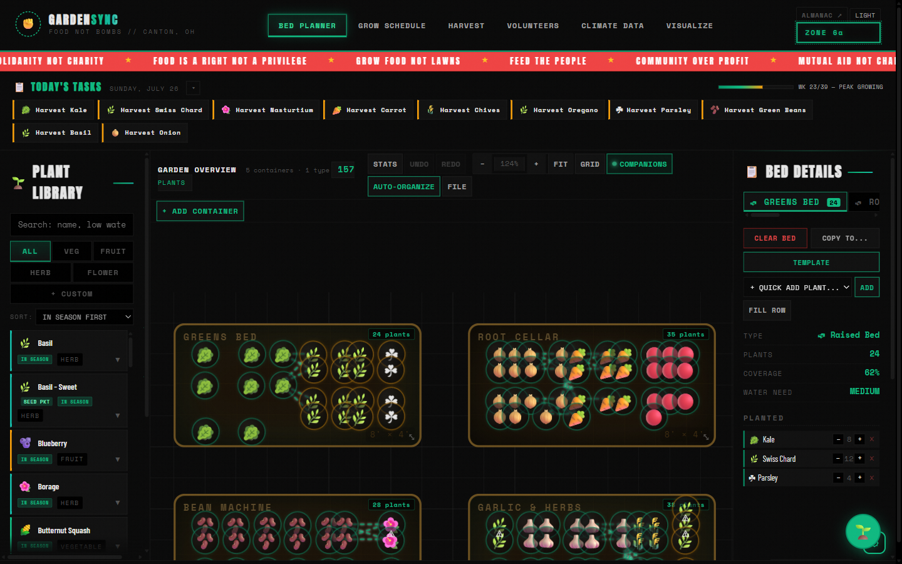
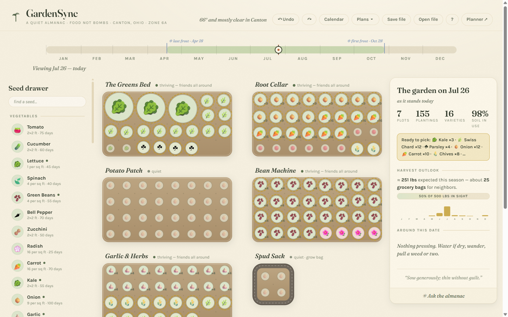

# GardenSync

**Community garden bed planner for Food Not Bombs — Canton, Ohio (USDA Zone 6a)**

Plan raised beds and containers on a square-foot grid, check companion planting
before you commit, track what you actually harvest, and hand a printable year to
the volunteer crew. No accounts, no server, no build step — everything lives in
your browser and travels as a JSON file or a link.

**[Open the planner](https://gardensync-e4e.pages.dev/)** ·
**[Open A Quiet Almanac](https://gardensync-e4e.pages.dev/fable/)** ·
[GitHub](https://github.com/Samizdat-Publications/gardensync)

---

## Two editions, one garden

The same agronomy — 77 plants, companion data, Zone 6a frost windows — rendered
with two very different temperaments. Each has its own save file; they don't
share state.

### The Planner — `/`



Loud and high-contrast: emerald on black, Anton display type, a manifesto ticker
across the top. Six workspaces — Bed Planner, Grow Schedule, Harvest, Volunteers,
Climate Data, Visualize — plus Garden Buddy, a Claude-powered assistant that can
place plants and rearrange beds for you.

### A Quiet Almanac — `/fable/`



Warm paper, botanical ink, and a year you scrub through. Drag the pin on the
season ribbon and the garden re-renders as the almanac imagines it on that date:
dashed ghosts before sowing, sprouts, full plants, gold harvest rings, sepia
spent crops. Companion halos glow while you're holding a seed packet, so you get
guidance *before* you plant rather than an error after.

Full notes: [`fable/README.md`](fable/README.md).

---

## Features

**Planning**
- Square-foot grid with real spacing — 16 carrots per square, one tomato per 2×2 ft
- Companion and antagonist relationships for every plant, drawn as connection lines
- Seven container types: raised beds, pots, tree pots, half barrels, grow bags,
  window boxes, steel troughs
- Auto-arrange a bed with Square Foot Gardening spacing
- Eleven demo gardens, including three researched FNB plans

**Through the season**
- Zone 6a schedule built from Canton frost dates (last Apr 18, first Oct 28)
- Today's Tasks — what to sow, transplant and pick this week
- Harvest logging with progress toward a poundage goal
- Live weather and a 7-day frost watch (Open-Meteo, no key needed)
- Printable year calendar for the crew

**Keeping it**
- Autosaves to localStorage; optional Supabase cloud sync
- JSON export/import, PNG snapshots, and share links that fold the whole garden
  into the URL
- Full undo/redo
- Custom seeds, including OCR from a photo of a seed packet

---

## The FNB demo gardens

Three researched plans for a Zone 6a community kitchen garden:

| Plan | Beds | Yield | Built for |
|------|------|-------|-----------|
| **Full Research Plan** | 5 | 400–600 lbs | 22 crops, high nutritional diversity |
| **Easy Start** | 5 | 130–225 lbs | Year one — low-maintenance crops only |
| **Max Storage** | 5 | 250–400 lbs | Shelf-stable, no-fridge pantry crops |

Easy Start loads automatically on a first visit. `FILE ▸ LOAD DEMO GARDEN`
switches between all eleven; `FILE ▸ NEW GARDEN` clears to empty beds.

---

## Run it locally

```bash
python proxy.py
```

Serves both editions on <http://localhost:8080> (planner at `/`, almanac at
`/fable/`) and proxies `/api/claude/*` and `/api/gemini/*` so the AI features
work in development.

### Tests

Open in a browser — there is no test runner:

- `tests/test-pure-logic.html` — unit tests for the pure logic functions
- `tests/test-integration.html` — integration tests

### Optional configuration

- **Cloud sync** — copy `js/supabase-config.example.js` to
  `js/supabase-config.js` and fill in your project details. Without it the app
  logs one line and runs happily on localStorage alone.
- **Garden Buddy** — paste your own Anthropic key when the chat asks. It is kept
  in your browser and sent straight to the API; it never reaches a server of ours.
- **Ask the almanac** — needs a `/api/claude/*` backend. `proxy.py` provides one
  locally; see *Deploying* for the hosted equivalent.

---

## Deploying

```bash
./deploy.sh
```

Stages a clean copy into `dist/` — the two apps and nothing else, deliberately
leaving behind the pre-refactor monolith, personal garden JSON, and screenshots —
then publishes to Cloudflare Pages.

`./deploy.sh --stage` builds `dist/` without deploying.

**Almanac chat on the hosted site** needs a Pages Function at
`functions/api/claude/[[path]].js` that forwards to `api.anthropic.com` using an
environment variable holding your key. Without it, the rest of the almanac works
normally and the chat reports that no answering service is configured.

---

## Architecture

No bundler, no framework, no npm. Every module is a plain `<script>` tag and
communicates through a shared global `state` object.

```
gardensync/
├── index.html              # The planner
├── styles.css              # All planner styling
├── js/                     # 33 modules, loaded in order by index.html
│   ├── state.js            # Global state, undo/redo stacks
│   ├── constants.js        # Plant library, Zone 6a data, demo gardens
│   ├── canvas.js           # Pan, zoom, transform, resizable panels
│   ├── placement.js        # Click-to-place, grid snapping, spacing checks
│   ├── containers.js       # Bed and container geometry
│   ├── persistence.js      # localStorage load/save, first-run seeding
│   ├── data-io.js          # Export/import, share links, demo registry
│   ├── garden-buddy.js     # Claude assistant with tool use
│   └── ...
├── fable/                  # A Quiet Almanac — four self-contained files
│   ├── index.html
│   ├── app.js
│   ├── plants.js
│   └── style.css
├── tests/                  # Browser-opened test pages
├── proxy.py                # Dev server + API proxy
└── deploy.sh               # Stage dist/ and publish
```

Beds, charts and climate graphics are all drawn programmatically on `<canvas>` or
inline SVG — no D3, no Chart.js.

**State** is one object, and every mutation goes through `pushUndo()`:

```javascript
state = {
  containers: [ { id, type, name, canvasX, canvasY, w, h, plants: [...] } ],
  volunteers: [...],
  canvasZoom, canvasOffsetX, canvasOffsetY,
  selectedContainer
}
```

---

## Garden Buddy

The assistant in the planner has tools for `place_plant`, `remove_plants`,
`clear_bed`, `apply_template`, `organize_bed`, `rename_bed`, `get_garden_state`,
`get_plant_info`, `list_plants` and `get_schedule_advice`. Its system prompt
carries the live garden state, frost dates and location, so "put four tomatoes in
the sunny bed" or "when should I start garlic here?" both work.

It runs on Claude Sonnet 5, called directly from the browser with your own key.

---

## Contributing

Fork, branch, change, open a pull request. Areas that would help most:

- More plants, especially regional and heirloom varieties
- Demo gardens for other zones and climates
- Volunteer scheduling UI
- Translations

---

## Credits & licence

Built by and for **Food Not Bombs Canton, Ohio** and the wider mutual-aid
gardening community. Companion planting data from published guides and years of
FNB kitchen-garden practice. Weather from [Open-Meteo](https://open-meteo.com).
AI from [Anthropic](https://www.anthropic.com). Fonts from Google Fonts.

Released under the **GNU Affero General Public License v3.0** — if you improve it,
share the improvements back.

**Let's grow food for our communities.** ✊
